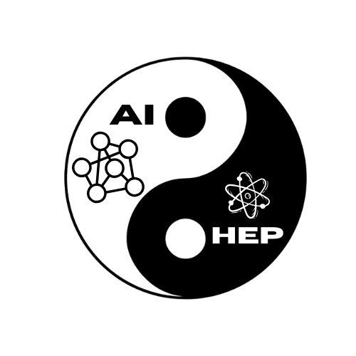

<div align="center">
  
  
  <h1>AI + HEP (East Asia) Website</h1>
  <p><strong>Community hub for advancing Artificial Intelligence in High Energy Physics across East Asia.</strong></p>
  <p>
    Workshops • Seminars • Journal Clubs • Curriculum • Collaboration
  </p>
</div>

---

## Overview
This repository contains the source for the AI+HEP East Asia community website, built with **Jekyll** (GitHub Pages compatible) and a customized **Minima** theme. It provides:

> Important: Most page content should be edited via data files (YAML) rather than directly modifying the Markdown pages unless you are restructuring layouts.

## Repository Structure (Relevant Parts)
```
docs/
  _config.yml               # Jekyll site configuration
  _data/
    journal_clubs.yml       # Source of truth for journal club sessions
  assets/
    main.scss               # Primary SCSS (compiled because it has front matter)
  images/                   # All image assets (profile, logos, hero art)
  00-about.markdown         # About content page
  01-organizers.markdown    # Organizer & volunteer listing 
  04-journalclubs.markdown  # Journal club 
  index.markdown            # Landing (hero + section summaries)
README.md                   # You are here
```

## Getting Started (Local Development)
1. Clone the repository:
   ```bash
   git clone https://github.com/ai-hep/ai-hep.github.io.git
   cd ai-hep.github.io/docs   
   ```
2. Install Ruby dependencies (ensure you have Bundler, Check [Jekyll docs](https://jekyllrb.com/docs/) to install required dependancies):
   ```bash
   bundle install
   ```
3. Serve locally:
   ```bash
   bundle exec jekyll serve
   ```
4. Open http://127.0.0.1:4000 (or the host/port printed in the terminal).

## Updating Journal Club Sessions
All sessions (upcoming & past) are managed exclusively in: `docs/_data/journal_clubs.yml`.

Each session entry follows a schema similar to:
```yaml
- date: 2025-09-05
  time: 17:00 JST
  topic: xyz
  status: completed            # or upcoming / canceled
  focused_paper:
    title: "Some Paper Title" # the main focus of the session. 
    arxiv: 2401.01234
    url: https://arxiv.org/abs/something # paper url. 
  related_papers:
    - title: abc
      arxiv: 2309.11111
      url: https://arxiv.org/abs/something
  description: |
    Brief description…
```

Rules / Guidelines:
- Keep dates in ISO format (`YYYY-MM-DD`).
- Maintain chronological integrity.
- Do not manually edit `04-journalclubs.markdown` for listing changes—Liquid loops read the YAML automatically.
- ArXiv numbers only (no `arXiv:` prefix) in `arxiv` fields; the template builds links.
- After editing the data file, open a Pull Request (do not force push) so changes are reviewed & tracked.

## Contributing
1. Fork the repository
2. Create a feature branch: `git switch -c feature/name`
3. Make changes (edit data)
4. Test locally
5. Open a Pull Request with a clear summary & screenshots if UI-related
6. Open an Issue if you experience any problems. 

Consider opening an issue first for larger structural changes (e.g., moving organizer data to YAML).

## License
This project is licensed under the **BSD 3-Clause License** (see `LICENSE`).

Third‑party components:
- Minima Jekyll Theme – MIT License (see `THIRD_PARTY_NOTICES.md`)
- GitHub Pages build toolchain – Various OSS licenses

By submitting a Pull Request you agree your contribution may be incorporated and redistributed under the project’s license terms.

---

## Third-Party Notices
See `THIRD_PARTY_NOTICES.md` for bundled third-party license texts or summaries.

## Contact
For questions or broader reuse requests: contact@ai-hep.org

---